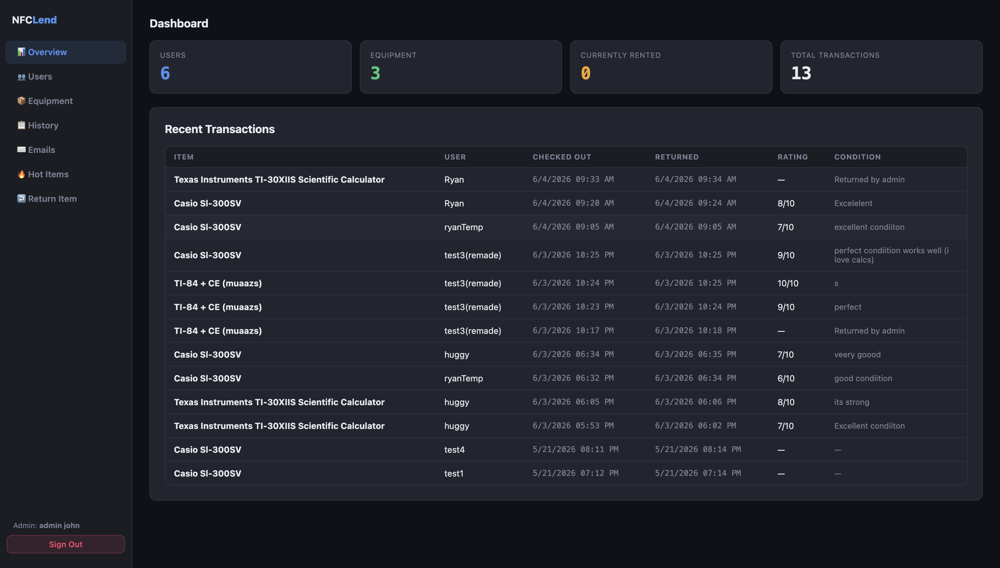
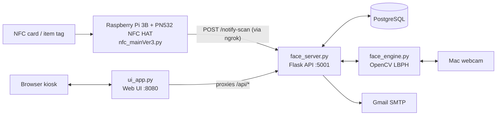
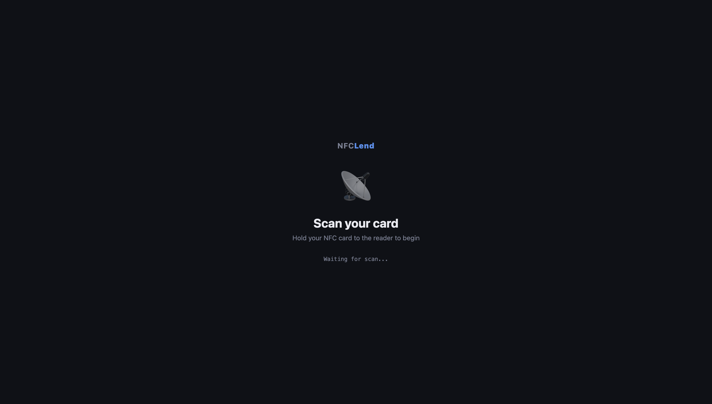
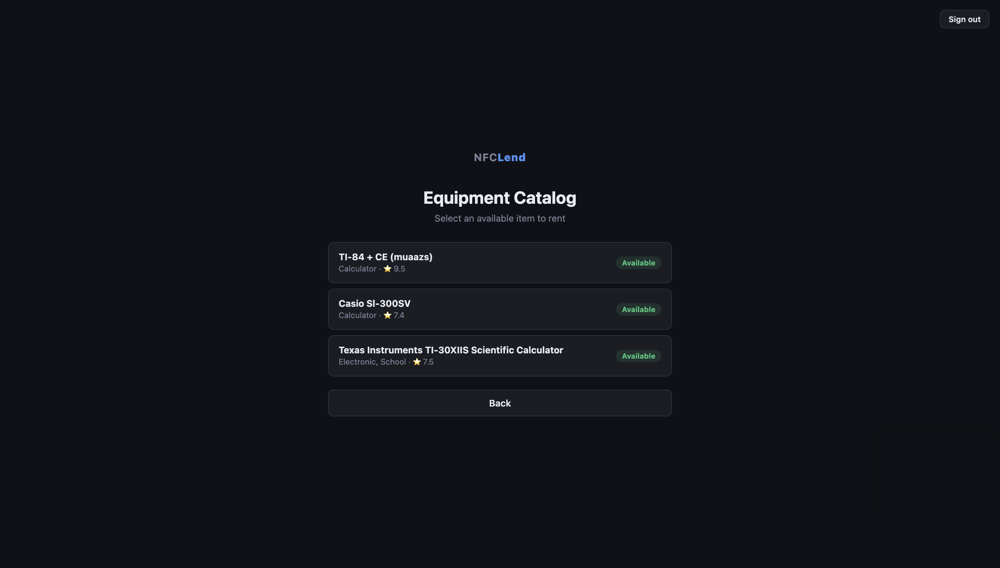
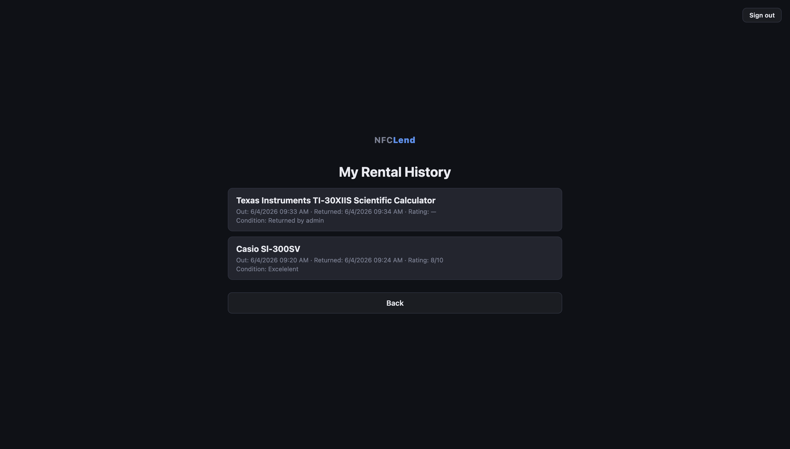

# NFCLend

An equipment lending system that uses **NFC cards**, **NFC-tagged items**, and **facial recognition** to check equipment in and out. Built as my senior-year high school CS Capstone project.

Users tap their NFC card on a Raspberry Pi reader, sign in with a password plus face verification, then tap the NFC sticker on an item to borrow or return it. Every checkout and return is logged and emailed to the user, and an admin dashboard manages users, inventory and rental history.

> **Status:** archived school project. The code is shared as a portfolio piece; it was built to run on my own hardware and isn't packaged as a general-purpose app.



## Features

**Users**
- Sign up by scanning a new NFC card, then register a face with the Mac's webcam (15 captured samples)
- Sign in with card scan, then password, then face verification (up to 3 attempts)
- Browse the equipment catalog and check out an available item by scanning its NFC tag
- Return an item by scanning it, rate it 1–10 and leave a condition report
- View personal rental history
- Edit name, email or password, or delete the account (which also deletes stored face images)
- Automatic confirmation emails on checkout and return

**Admin** (admin card and password, no face check)
- Dashboard with totals and recent transactions
- Manage users: delete accounts or reset a user's face data
- Add equipment by scanning a new NFC tag, or remove items
- Full rental history with ratings and condition reports
- Send return reminders or custom emails to users
- "Hot items" view ranking equipment by rentals and average rating
- Return an item on a user's behalf

**Under the hood**
- Soft deletes, so rental history stays intact after a user or item is removed
- Items track a running average rating from returns
- Face verification attempts are logged with their confidence score
- Terms of Service and face-data consent shown at registration

## How it works



| File | Runs on | What it does |
|---|---|---|
| `nfc_mainVer3.py` | Raspberry Pi | Reads card and tag UIDs from the PN532 over I²C and posts each scan to the server |
| `face_server.py` | Mac | Flask REST API: users, equipment, checkout/return, history, stats, email and face endpoints |
| `face_engine.py` | Mac | Face detection (Haar cascade) and recognition (LBPH) with OpenCV; stores samples per user |
| `ui_app.py` | Mac | Single-page kiosk UI that polls for scans and proxies requests to the API |
| `schema.sql` | — | PostgreSQL table definitions |

The Pi only handles NFC reading. Everything else (API, database, face recognition, UI) ran on my MacBook, and the Pi reached it through an ngrok tunnel.

## Tech stack

Python · Flask · PostgreSQL (psycopg2) · OpenCV (Haar cascades + LBPH face recognizer) · NumPy · HTML/CSS/JavaScript · Raspberry Pi 3B · PN532 NFC (Adafruit CircuitPython) · Gmail SMTP · ngrok

## Screenshots

| Scan screen | Equipment catalog | My history |
|---|---|---|
|  |  |  |

## Running it

You'd need the same hardware setup (a Pi with a PN532 reader, NFC cards/stickers and a webcam), but for reference:

1. **Database:** install PostgreSQL, then `createdb nfcproject && psql nfcproject -f schema.sql`, and insert an admin user (see the bottom of `schema.sql`).
2. **Config:** `cp .env.example .env` and fill in a Gmail App Password and your DB settings.
3. **Mac:**
   ```bash
   pip install -r requirements.txt
   cd nfc-face-serverVer2
   python face_server.py   # API on :5001
   python ui_app.py        # UI on http://localhost:8080
   ```
4. **Tunnel:** `ngrok http 5001`, and set `NFCLEND_SERVER` to the ngrok URL.
5. **Raspberry Pi:** enable I²C, `pip install -r requirements-pi.txt`, then run `python nfc_mainVer3.py`.

## Limitations / what I'd do differently

This was a prototype built for a class demo, so some shortcuts were taken:

- Passwords are stored in plain text and checked in the browser. A real version would hash them (bcrypt) and check them on the server.
- The API has no authentication, and admin actions are only protected by the UI.
- LBPH face recognition is lightweight but not very robust (lighting-sensitive, no liveness check), and users can fall back to password-only after 3 failed attempts.
- Scan state is a single global value, so it supports one kiosk at a time.
